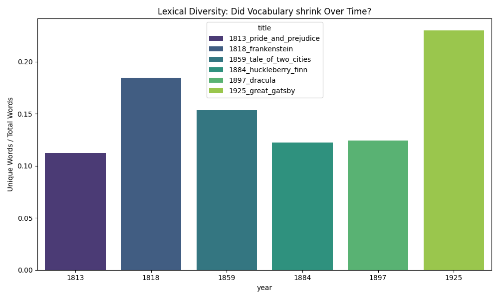
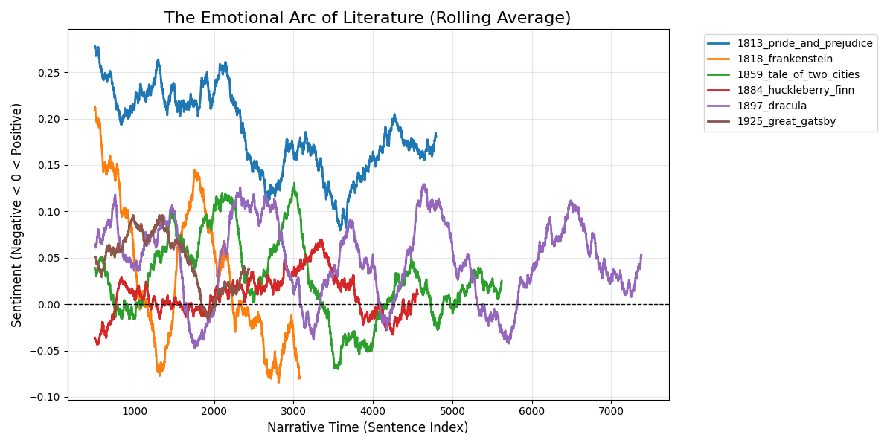
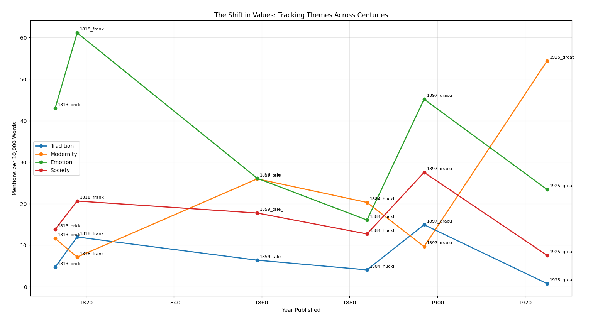
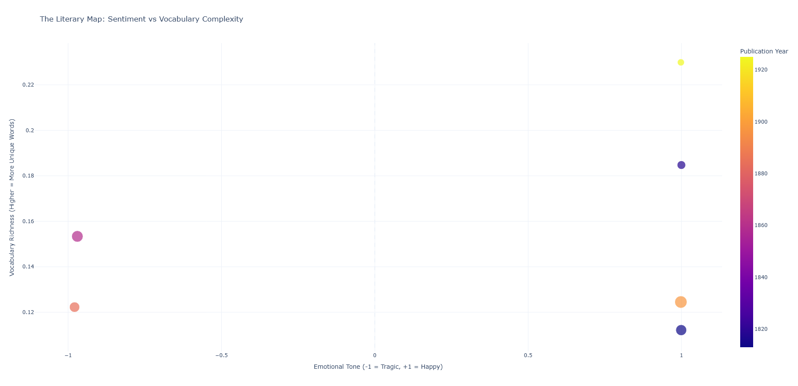

# The Literary Time Machine

### Quantifying the Evolution of Literature using NLP & Python

**Project Status:** ✅ Complete

## Overview
Does human emotion change over centuries? Do we use simpler words today than we did in the 1800s?

**The Literary Time Machine** is a Data Science pipeline that ingests, cleans, and analyzes full-text novels from Project Gutenberg to answer these questions. By processing over **500,000 words** of unstructured text data, this project quantifies the "shape" of stories and tracks cultural shifts in vocabulary (e.g., the rise of "Technology" vs. the fall of "Tradition").

## Key Findings

### 1. The Myth of "Dumbing Down" (Lexical Diversity)
Contrary to the hypothesis that modern vocabulary has degraded, **The Great Gatsby (1925)** exhibited the highest lexical diversity in the dataset, outperforming books from the 1800s.
* **Insight:** Literary complexity is driven more by **Author Style** than by the era itself.
* **Context:** *Huckleberry Finn* (1884) scored lower not because of "simpler" times, but because Twain utilized **dialect and colloquialism** as a stylistic feature.

### 2. The Mathematical Shape of Tragedy
Using VADER sentiment analysis, we successfully recovered the quantitative "signature" of literary archetypes.
* **The Tragedy:** *Frankenstein* (1818) begins with high positive sentiment (the joy of discovery) and steadily crashes into negative territory, mathematically mapping the "Fall from Grace" arc.
* **The Comedy:** *Pride and Prejudice* (1813) exhibits high volatility (conflict) but consistently trends upward, resolving in a "Happy Ending" signature.

### 3. The Gothic Paradox (Trends Over Time)
Historical progression is not linear. Despite being written nearly a century after *Pride and Prejudice*, **Dracula (1897)** scored significantly lower on "Modernity" keywords and higher on "Tradition."
* **Insight:** **Genre is a stronger predictor than Time.** The Gothic Horror genre necessitates archaic vocabulary ("castle", "blood", "lord"), which artificially "ages" the data, creating an anomaly in the timeline.

### 4. Limitation Discovery: The "Gatsby" Irony
*The Great Gatsby* clustered in the "Happy & Complex" quadrant of our Interactive Map.
* **Critical Analysis:** This highlights a limitation of lexicon-based Sentiment Analysis (VADER). The model detected positive words associated with wealth ("party", "gold", "love") but failed to capture the **tragic irony** and underlying sarcasm of the novel. This suggests that future iterations would benefit from context-aware models (e.g., BERT) rather than bag-of-words approaches.

## Visualizations

### 1. Lexical Diversity Comparison
*Disproving the vocabulary decline hypothesis.*


### 2. The Emotional Arc of Literature
*Tracing the sentiment volatility of 6 classic novels using a rolling average.*


### 3. Cultural Shifts: Tradition vs. Modernity
*Tracking the decline of Traditional values and the rise of Modern themes.*


### 4. The Literary Map (Interactive Dashboard)
*Clustering books by emotional tone and vocabulary complexity.*


## Tech Stack
* **Language:** Python 3.12
* **Data Manipulation:** Pandas, NumPy
* **Natural Language Processing:** NLTK (Tokenization, Stopword Removal, VADER Sentiment)
* **Visualization:** Plotly (Interactive), Matplotlib/Seaborn (Static)
* **Version Control:** Git & GitHub

## How to Run
1.  **Clone the repository:**
    ```bash
    git clone [https://github.com/beaandrea/literary-time-machine.git](https://github.com/beaandrea/literary-time-machine.git)
    ```
2.  **Install dependencies:**
    ```bash
    pip install -r requirements.txt
    ```
3.  **Run the analysis pipeline:**
    ```bash
    python scripts/6_interactive_viz.py
    ```

## Author

**Bea Gamilong** <br>
*Data Analyst* <br>
*I build tools that turn messy data into clear narratives.* <br><br>
[LinkedIn](https://www.linkedin.com/in/bea-andrea-gamilong) | [Email](mailto:beaandreagamilong@gmail.com)